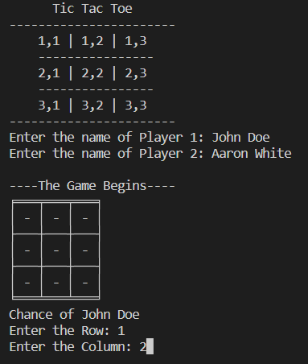
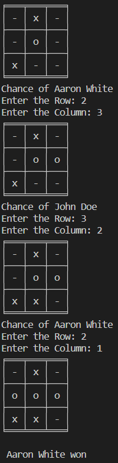

# Tic Tac Toe

CLI based simple Tic Tac Toe game built using Python.

## How to play

1. Clone the repository  
   `git clone https://github.com/Anubhav-Pathak/Python-Projects.git`

2. Navigate to Tic Tac Toe folder  
   `cd "Tic Tac Toe"`

3. Run Tic Tac Toe.py  
   `python "Tic Tac Toe.py"`

## Gampeplay  

  

## Technologies Used

